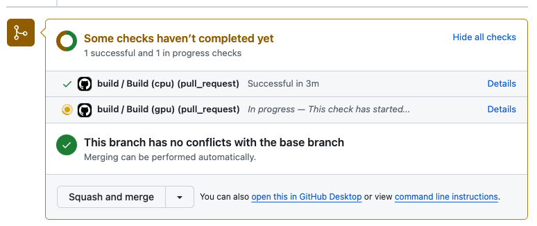

# Youth Mental Health: Automated Abstraction

 [![Youth Mental Health: Automated Abstraction](https://img.shields.io/badge/DrivenData-Youth%20Mental%20Health:%20Automated%20Abstraction-white?logo=data:image/png;base64,iVBORw0KGgoAAAANSUhEUgAAABAAAAAQCAYAAAAf8/9hAAAABGdBTUEAALGPC/xhBQAABBlpQ0NQa0NHQ29sb3JTcGFjZUdlbmVyaWNSR0IAADiNjVVdaBxVFD67c2cjJM5TbDSFdKg/DSUNk1Y0obS6f93dNm6WSTbaIuhk9u7OmMnOODO7/aFPRVB8MeqbFMS/t4AgKPUP2z60L5UKJdrUICg+tPiDUOiLpuuZOzOZabqx3mXufPOd75577rln7wXouapYlpEUARaari0XMuJzh4+IPSuQhIegFwahV1EdK12pTAI2Twt3tVvfQ8J7X9nV3f6frbdGHRUgcR9is+aoC4iPAfCnVct2AXr6kR8/6loe9mLotzFAxC96uOFj18NzPn6NaWbkLOLTiAVVU2qIlxCPzMX4Rgz7MbDWX6BNauuq6OWiYpt13aCxcO9h/p9twWiF823Dp8+Znz6E72Fc+ys1JefhUcRLqpKfRvwI4mttfbYc4NuWm5ERPwaQ3N6ar6YR70RcrNsHqr6fpK21iiF+54Q28yziLYjPN+fKU8HYq6qTxZzBdsS3NVry8jsEwIm6W5rxx3L7bVOe8ufl6jWay3t5RPz6vHlI9n1ynznt6Xzo84SWLQf8pZeUgxXEg4h/oUZB9ufi/rHcShADGWoa5Ul/LpKjDlsv411tpujPSwwXN9QfSxbr+oFSoP9Es4tygK9ZBqtRjI1P2i256uv5UcXOF3yffIU2q4F/vg2zCQUomDCHvQpNWAMRZChABt8W2Gipgw4GMhStFBmKX6FmFxvnwDzyOrSZzcG+wpT+yMhfg/m4zrQqZIc+ghayGvyOrBbTZfGrhVxjEz9+LDcCPyYZIBLZg89eMkn2kXEyASJ5ijxN9pMcshNk7/rYSmxFXjw31v28jDNSpptF3Tm0u6Bg/zMqTFxT16wsDraGI8sp+wVdvfzGX7Fc6Sw3UbbiGZ26V875X/nr/DL2K/xqpOB/5Ffxt3LHWsy7skzD7GxYc3dVGm0G4xbw0ZnFicUd83Hx5FcPRn6WyZnnr/RdPFlvLg5GrJcF+mr5VhlOjUSs9IP0h7QsvSd9KP3Gvc19yn3Nfc59wV0CkTvLneO+4S5wH3NfxvZq8xpa33sWeRi3Z+mWa6xKISNsFR4WcsI24VFhMvInDAhjQlHYgZat6/sWny+ePR0OYx/mp/tcvi5WAYn7sQL0Tf5VVVTpcJQpHVZvTTi+QROMJENkjJQ2VPe4V/OhIpVP5VJpEFM7UxOpsdRBD4ezpnagbQL7/B3VqW6yUurSY959AlnTOm7rDc0Vd0vSk2IarzYqlprq6IioGIbITI5oU4fabVobBe/e9I/0mzK7DxNbLkec+wzAvj/x7Psu4o60AJYcgIHHI24Yz8oH3gU484TastvBHZFIfAvg1Pfs9r/6Mnh+/dTp3MRzrOctgLU3O52/3+901j5A/6sAZ41/AaCffFUDXAvvAAAAIGNIUk0AAHomAACAhAAA+gAAAIDoAAB1MAAA6mAAADqYAAAXcJy6UTwAAABEZVhJZk1NACoAAAAIAAIBEgADAAAAAQABAACHaQAEAAAAAQAAACYAAAAAAAKgAgAEAAAAAQAAABCgAwAEAAAAAQAAABAAAAAA/iXkXAAAAVlpVFh0WE1MOmNvbS5hZG9iZS54bXAAAAAAADx4OnhtcG1ldGEgeG1sbnM6eD0iYWRvYmU6bnM6bWV0YS8iIHg6eG1wdGs9IlhNUCBDb3JlIDUuNC4wIj4KICAgPHJkZjpSREYgeG1sbnM6cmRmPSJodHRwOi8vd3d3LnczLm9yZy8xOTk5LzAyLzIyLXJkZi1zeW50YXgtbnMjIj4KICAgICAgPHJkZjpEZXNjcmlwdGlvbiByZGY6YWJvdXQ9IiIKICAgICAgICAgICAgeG1sbnM6dGlmZj0iaHR0cDovL25zLmFkb2JlLmNvbS90aWZmLzEuMC8iPgogICAgICAgICA8dGlmZjpPcmllbnRhdGlvbj4xPC90aWZmOk9yaWVudGF0aW9uPgogICAgICA8L3JkZjpEZXNjcmlwdGlvbj4KICAgPC9yZGY6UkRGPgo8L3g6eG1wbWV0YT4KTMInWQAAAGZJREFUOBFj/HdD5j8DBYCJAr1grSzzmDRINiNFbQ8jTBPFLoAZNHA04/O8g2THguQke0aKw4ClX5uw97vS7eGhjq6aYhegG0h/PuOfohCyYoGlbw04XCgOA8bwI7PIcgEssCh2AQDqYhG4FWqALwAAAABJRU5ErkJggg==)](https://www.drivendata.org/competitions/295/cdc-automated-abstraction/)

Welcome to the runtime repository for the [Youth Mental Health: Automated Abstraction](https://www.drivendata.org/competitions/295/cdc-automated-abstraction/) challenge on DrivenData! This repository contains a few things to help you create your code submission for this code execution competition:

1. **Submission template** ([`examples/template/`](./examples/template/main.py)) — a template with the function signatures that you should implement in your submission.
1. **Example submission** ([`examples/submission/`](./examples/submission/main.py/)) — a submission with a simple demonstration solution. It will run successfully in the code execution runtime and outputs a valid submission.
1. **Runtime environment specification** ([`runtime/`](./runtime/)) — the definition of the environment in which your code will run.

You can use this repository to:

🔧 **Test your submission**: Test your submission using a locally running version of the competition runtime to discover errors before submitting to the competition website.

📦 **Request new packages in the official runtime**: Since your submission will not have general access to the internet, all dependencies must be pre-installed. If you want to use a package that is not in the runtime environment, make a pull request to this repository. Make sure to test out adding the new package to both official environments (CPU and GPU).

Changes to the repository are documented in [CHANGELOG.md](./CHANGELOG.md).

---

#### [1. Quickstart](#quickstart)

- [Prerequisites](#prerequisites)
- [Setting up the data directory](#setting-up-the-data-directory)

#### [2. Testing your submission locally](#testing-your-submission)
- [Code submission format](#code-submission-format)
- [Running your submission locally](#running-your-submission-locally)
- [Running the example submission locally](#running-the-example-submission-locally)
- [Smoke tests](#smoke-tests)

#### [3. Updating runtime packages](#updating-runtime-packages)

#### [4. Makefile commands](#makefile-commands)

---

## Quickstart

This quickstart guide will show you how to get the provided example solution running end-to-end. Once you get there, it's off to the races!

### Prerequisites

When you make a submission on the DrivenData competition site, we run your submission inside a Docker container, a virtual operating system that allows for a consistent software environment across machines. **The best way to make sure your submission will run sucessfully is to test it in a container on your local machine first.** For that, you'll need:

- A clone of this repository
- [Docker](https://docs.docker.com/get-docker/)
- At least 5 GB of free space for the CPU version of the Docker image or at least 15 GB of free space for the GPU version
- [GNU make](https://www.gnu.org/software/make/) (optional, but useful for running the commands in the Makefile)

Additional requirements to run with GPU:

- [NVIDIA drivers](https://docs.nvidia.com/cuda/cuda-installation-guide-linux/index.html#package-manager-installation) with CUDA 11
- [NVIDIA container toolkit](https://docs.nvidia.com/datacenter/cloud-native/container-toolkit/latest/index.html)


### Setting up the data directory

In the official code execution platform, `code_execution/data` will contain features for the test set. See the [code submission page](https://www.drivendata.org/competitions/295/cdc-automated-abstraction/page/923/#test-features) for details of the `code_execution/data/test_features.csv` file.

To test your submission in a local container, save a file under `data/test_features.csv` that matches the format of the actual test features file. For example, you could use a set of training examples. When you run your submission in a Docker container locally, the file you provide will be included in the container.

## Testing your submission

As you develop your own submission, you'll need to know a little bit more about how your submission will be unpacked for running inference. This section contains more complete documentation for developing and testing your own submission.

### Code submission format

Your final submission should be a zip archive named with the extension `.zip` (for example, `submission.zip`).

A template for `main.py` is included at [`examples/template/main.py`](./examples/template/main.py). For more detail, see the "what to submit" section of the code submission page.

### Running your submission locally

This section provides instructions on how to run your submission in the code execution container from your local machine. To simplify the steps, key processes have been defined in the `Makefile`. Commands from the `Makefile` are then run with `make {command_name}`. The basic steps are:

```sh
make pull
make pack-submission
make test-submission
```

Run `make help` for more information about the available commands as well as information on the official and built images that are available locally.

Here's the process in a bit more detail:

1. First, make sure you have set up the [prerequisites](#prerequisites).

2. Run **`make pull`** to download the official competition Docker image

> [!NOTE]
> If you have built a local version of the runtime image with `make build`, that image will take precedence over the pulled image when using any make commands that run a container. You can explicitly use the pulled image by setting the `SUBMISSION_IMAGE` shell/environment variable to the pulled image or by deleting all locally built images.

3. Save all of your submission files, including the required `main.py` script, in the `submission_src` folder of the runtime repository. Make sure any needed model weights and other assets are saved in `submission_src` as well.

4. Run **`make pack-submission`** to create a `submission/submission.zip` file containing your code and model assets. This `submission.zip` file is what you will ultimately submit on the competition website.

    ```sh
    make pack-submission
    #> mkdir -p submission/
    #> cd submission_src; zip -r ../submission/submission.zip ./*
    #>   adding: main.py (deflated 73%)
    ```

5. Run **`make test-submission`** to simulate what happens during code execution on your local machine. This command launches an instance of the competition Docker images and runs the container [entrypoint](./runtime/entrypoint.sh) script. First, it unzips `submission/submission.zip` into `/code_execution/` in the container. Then, it runs your submitted `main.py`. In the local testing setting, the final submission is saved out to the `submission/` folder on your local machine. This is the same inference process that will take place in the official runtime.

    ```sh
    make test-submission
    ```

> [!NOTE]
> Remember that `/code_execution/data` is just a mounted version of what you have saved locally in `data` so you will just be using the training files for local testing. In the official code execution platform, `/code_execution/data` will contain the actual test data.

🎉 **Congratulations!** You've just completed your first test run for the Youth Mental Health: Automated Abstraction. If everything worked as expected, you should see that a new file `submission/submission.csv` has been generated.

When you run `make test-submission` the logs will be printed to the terminal and written out to `submission/log.txt`. If you run into errors, use the container logs written to `log.txt` to determine what changes you need to make for your code to execute successfully.

### Running the example submission locally

Before you test your own submission, you can test the process above with the provided example submission first. This will follow the same process as running your submission, but will use the code in `examples/submission` instead of the code in `submission_src`.

To run the example submission using `make` commands, make sure that Docker is running and then run the following in the terminal:

1. **`make pull`** pulls the latest official Docker image from the container registry ([Azure](https://azure.microsoft.com/en-us/services/container-registry/)). You'll need an internet connection for this.
2. **`make pack-example`** packages all files saved in the `examples/submission` directory to `submission/submission.zip`
3. **`make test-submission`** simulates a code execution submission with `submission/submission.zip`. This will run `examples/submission/main.py` from within a Docker container to generation `submission.csv`.

### Smoke tests

In order to prevent leakage of the test features, **all logging is prohibited when running inference on the test features** as part of an official submission. When submitting on the platform, you will have the ability to submit "smoke tests". Smoke tests run with logging enabled on a reduced version of the training set notes in order to run more quickly. They will not be considered for prize evaluation and are intended to let you test your code for correctness. In this competition, smoke tests will be the only place you can view logs or output from your code to debug. **You should test your code locally as thorougly as possible before submitting your code for smoke tests or for full evaluation.**

## Updating runtime packages

If you want to use a package that is not in the environment, you are welcome to make a pull request to this repository. Remember, your submission will only have access to packages in this runtime repository. If you're new to the GitHub contribution workflow, check out [this guide by GitHub](https://docs.github.com/en/get-started/quickstart/contributing-to-projects).

The runtime manages dependencies using [Pixi](https://pixi.sh/latest/). Here is a good [tutorial](https://pixi.sh/latest/tutorials/python/) to get started with Pixi. The official runtime uses **Python 3.10.13**.

1. Fork this repository.

2. Install pixi. See [here](https://pixi.sh/latest/) for installation options.

3. Edit the `runtime/pixi.toml` file to add your new packages in the [`dependencies`](https://pixi.sh/latest/reference/project_configuration/#the-dependencies-tables) section. You'll need to determine which environment(s) your new package is required for, and whether the package will be installed with conda (preferred) or pip.

    - **CPU, GPU, or base:** The `pixi.toml` file includes different sections for dependencies that apply to both the CPU and GPU environments (`feature.base`), the CPU environment only (`feature.cpu`), and the GPU environment only (`feature.gpu`).

    - **Conda or pip:** Packages installed using conda are specified by the header `dependencies`. These install from the [conda-forge](https://anaconda.org/conda-forge/) channel using `conda install`. Packages installed with pip are specified by the header `pypi-dependencies`. These install from PyPI using `pip`. **Installing packages with conda is strongly preferred.** Packages should only be installed using `pip` if they are not available in a conda channel. Conda dependencies are much [faster](https://pixi.sh/latest/features/environment/#solving-environments) to resolve than PyPI dependencies.

    - For example, to add version 0.0.1 of `package1` to both the CPU and GPU environments using conda, you would add the line `package1 = "0.0.1"` under [`[feature.base.dependencies]`](https://github.com/drivendataorg/youth-mental-health-runtime/blob/9824c1f124133b4cc18e39ea01e70c9a6a878684/runtime/pixi.toml#L10). To add version 0.2 of `package2` to the CPU environment only using pip, you would add the line `package2 = { version = "0.2.*" }` under the header `[feature.cpu.pypi-dependencies]`.
        ```
        [feature.base.dependencies]
        package1 = "0.0.1"

        [feature.cpu.pypi-dependencies]
        package2 = { version = "0.2.*" }
        ```

4. With Docker open and running, run `make update-lockfile`. This will generate an updated `runtime/pixi.lock` from `runtime/pixi.toml` within a Docker container. 

5. Locally test that the Docker image builds successfully for both the CPU and GPU environment:

    ```sh
    CPU_OR_GPU=cpu make build
    CPU_OR_GPU=gpu make build
    ```

6. Commit the changes to your forked repository. Ensure that your branch includes updated versions of both `runtime/pixi.toml` and `runtime/pixi.lock`.
   
7. Open a pull request from your branch to the `main` branch of this repository. Navigate to the [Pull requests](https://github.com/drivendataorg/youth-mental-health-runtime/pulls) tab in this repository, and click the "New pull request" button. For more detailed instructions, check out [GitHub's help page](https://help.github.com/en/articles/creating-a-pull-request-from-a-fork).

8. Once you open the pull request, we will use Github Actions to build the Docker images with your changes and run the tests in `runtime/tests`. For security reasons, administrators may need to approve the workflow run before it happens. Once it starts, the process can take up to 30 minutes, and may take longer if your build is queued behind others. You will see a section on the pull request page that shows the status of the tests and links to the logs ("Details"):

    

9.  You may be asked to submit revisions to your pull request if the tests fail or if a DrivenData staff member has feedback. Pull requests won't be merged until all tests pass and the team has reviewed and approved the changes.

## Make commands

A Makefile with several helpful shell recipes is included in the repository. The runtime documentation above uses it extensively. Running `make` by itself in your shell will list relevant Docker images and provide you the following list of available commands:

```
Available commands:

build               Builds the container locally 
clean               Delete temporary Python cache and bytecode files 
interact-container  Open an interactive bash shell within the running container (with network access) 
pack-example        Creates a submission/submission.zip file from the source code in examples_src 
pack-submission     Creates a submission/submission.zip file from the source code in submission_src 
pull                Pulls the official container from Azure Container Registry 
test-container      Ensures that your locally built image can import all the Python packages successfully 
                    when it runs 
test-submission     Runs container using code from `submission/submission.zip` and data from 
                    `/code_execution/data/` 
update-lockfile     Updates runtime environment lockfile using Docker 
```
